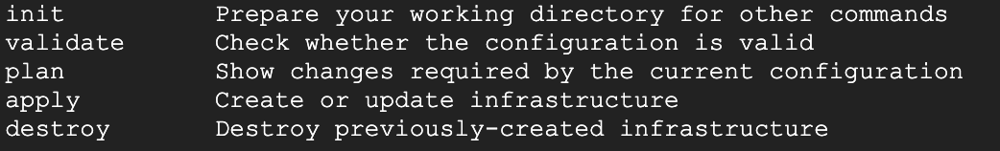

### Terraform

#### Terraform Fundamentals

1. What is Terraform?
    >Terraform 是一種用來安全高效的建構、更改及版控基礎設施的工具，可以有效管理現有雲服務供應商資源的解決方案，包括：instance、storage、network等SAAS應有的相關功能。

2. Key Features

    - Infrastructure as code: 透過腳本描述基礎設施，就像是寫程式一樣，可重用、共享及版控
    - Execution plans: 執行腳本時可以先透過 `plan` 進行差異檢視，能夠在腳本實際應用前確認執行結果
    - Resource graph: 執行腳本後可以透過 `graph` 檢視目前 terraform 的資源
    - Change automation: 人為操作流程雲廠商的服務雖然簡單但卻是不可控的，長期下來這些操作只會增加教育成本，而透過 tf 腳本、及上述 command line 可以透過自動化來減少人工調整基礎設施的機會

3. Terraform 安裝

    如果是個人練習建議可以自行安裝
    > https://www.terraform.io/downloads
    
    而小型團隊或企業可以嘗試 Terraform cloud | enterprise
    > Cloud: https://cloud.hashicorp.com/products/terraform

    > Enterprise: https://www.hashicorp.com/products/terraform

4. Terraform Registry

    存放 Terraform 目前所支援的雲端供應商及能輔助使用 module
    > Terraform Registry: https://registry.terraform.io 

5. Terraform commandline

    Main commands
    > init, validate, plan, apply, destroy
    

    All other commands:
    

6. Terraform workflow
    簡單來說 Terraform workflow 會像是這樣
    
        1. 寫好 tf 檔，執行 `terraform init` 初始化
        2. 執行 `terraform plan` 查看tf內容的預期作業狀況
        3. 執行 `terraform apply` 實際建置出 tf 內容 
    

7. 語法介紹

    一個典型的 tf 資源寫法如下：
    ```sh
    resource "type" "var_name"{
    }
    ```

    以 Google 資源來說：
    > https://registry.terraform.io/providers/hashicorp/google/latest/docs/resources/compute_instance
    ```sh
    resource "google_compute_instance" "terraform" {
        project      = "<PROJECT_ID>"
        name         = "terraform"
        depends_on = ["google_storage_bucket.example_bucket"]
        machine_type = "n1-standard-1"
        zone         = "us-central1-a"
        boot_disk {
            initialize_params {
            image = "debian-cloud/debian-9"
            }
        }
        network_interface {
            network = "default"
            access_config {
            }
        }
    }
    ```

8. What is a Terraform module?

    通常在執行 terraform 的路徑會視為 main module，如果 main module 有使用到其他模塊，那其他模塊則稱為 sub module
    
    一個 module 是為了一個為特定目的而撰寫的模組，通常一個模組的結構如下：
    
    > main.ft 模組的主要配置主檔
    > variables.tf 定義在執行時會使用到的變數
    > outputs.tf 定義輸出變數，可供其他配置做使用

9. Local and remote modules 本機及遠端模組

    Terraform module 模組文件可以從本機取用或者是使用遠端載入，包括：Terraform Registry, SVM, Http Url, Terraform Cloud, Terraform Enterprise 等。

10. Module best practices

    模組化設計就如同撰寫其他高階程式碼一樣，為了去耦合及方便重用。

    - 從 Terraform Registry 找出適合的模組進而加速基礎設施的建置
    - 當基礎架構變得越來越複雜時，模組化可以有效減少維護和更新配置的負擔
    - 為組織建立模組應變不同的使用情境需求

    更多詳細的 ｍodule 使用方式
    > https://github.com/terraform-google-modules

11. 注意執行 terraform 後會產生不同的暫存檔案：

    10.1 `.terraform` 在 `init` 階段產生，該資料夾用來存放 provider 所提供的模組資訊

    10.2 `terraform.tfstate`, `terraform.tfstate.backup` 在 `apply` 階段產生，該文件包含 Terraform 狀態，及 Terraform 用來踪配置腳本與基礎設施之間的關係。

12. Purpose of Terraform state

    Terraform state 是 Terraform 的核心概念，當每次 `apply` 階段產生`terraform.tfstate`, `terraform.tfstate.backup`，可以透過編輯器查看內容大致會與當初的配置腳本相同，只不過多出了更多的資料，產生的狀態檔會作為下次 `plan` 的依據，那麼怎麼管理 state 就會變成另外一個問題。

13. Working with backends

    Terraform state 儲存狀態文件的位置稱為 backend，而管理狀態文件就是從此處去處理，可分為 `local` 與 `remote`。
    
    > `local`:
    在預設的情況下執行 terraform 指令時，則 backend 的位置就會是在本機的磁碟中
    https://www.terraform.io/language/settings/backends/local

    > `remote`:
    遠端後端有助於團隊合作可以透過狀態鎖保護該狀態以防止損壞，此外也能夠防止本機磁碟被檢索狀態文件的機率，目前支援的遠端後端有： artifactory, azurerm, consul, etcd, etcd3, gcs, http, kubernetes, manta, oss, pg, aws, swift,Terraform Cloud
    https://www.terraform.io/language/settings/backends/configuration#available-backends


14. Terraform import 

    > 將 `現有資源` 導入 Terraform 腳本中

    大部分在 Registry 的 provider 都會提供 import 的使用方式
    > GCP: 
    https://registry.terraform.io/providers/hashicorp/google/latest/docs/resources/compute_instance#import

    > Vault:
    https://registry.terraform.io/providers/hashicorp/vault/latest/docs/resources/approle_auth_backend_role#import

    > `要注意的是，非所有 provider 都支援 Terraform Import`

15. Terraform Import workflow
    實務上，容易發生下列的情況，就是我們已經有了已存在的infra 項目
    

16. Limitations and other considerations before import

    1. import 不會得知 infra 與 infra 的關係
    2. 建立 infra 備份

17. 練習 with `local_file`

    ```sh
    resource "local_file" "foo" {
        content = "I love terraform."
        filename = "abc.txt"
    }
    ```

18. 練習 with `docker`

    > https://hub.docker.com/_/nginx
    > https://hub.docker.com/_/alpine

    ```sh
    terraform {
        required_providers {
            docker = {
            source  = "kreuzwerker/docker"
            version = "2.17.0"
            }
        }
    }

    provider "docker" {
        # host = "unix:///var/run/docker.sock"
    }
    resource "docker_image" "alpine" {
        name = "alpine:3.16.0"
    }
    # resource "docker_image" "python" {
    #    name = "python:3.8-slim"
    # }
    resource "docker_image" "nginx" {
        name = "nginx:1.23.0"
    }

    ## step 1
    # resource "docker_container" "nginx" {
    #     name  = "my_nginx"
    #     image = docker_image.nginx.latest
    #     ## step 2
    #     # ports {
    #     #     external = 8080
    #     #     internal = 80
    #     #     ip       = "0.0.0.0"
    #     #     protocol = "tcp"
    #     # }
    #     ## step 3
    #     # volumes {
    #     #     host_path      = "${path.cwd}/html"
    #     #     container_path = "/usr/share/nginx/html"
    #     # }
    # }
    ```  

#### Ref:
> terraform: https://www.terraform.io/

> download & install: https://www.terraform.io/downloads

> Terraform Registry: https://registry.terraform.io/

> Terraform Cloud: https://cloud.hashicorp.com/products/terraform

> Terraform Enterprise: https://www.terraform.io/enterprise

> Automating Infrastructure on Google Cloud with Terraform: https://www.cloudskillsboost.google/quests/159